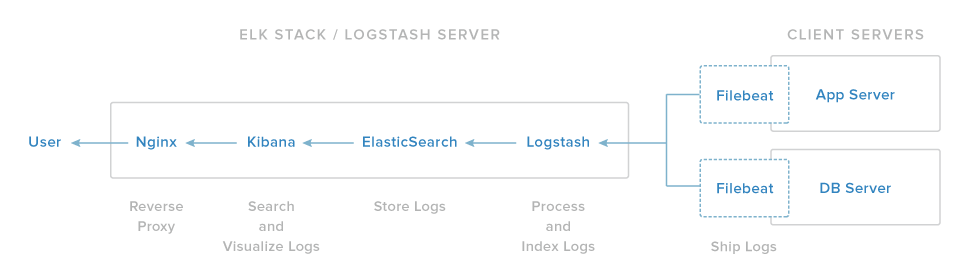

# The Elastic Stack

In this turorial we will learn how to parse, store and visualise data using the elastic stack. 

The elastic stack is the name given to the following collection of tools: Kibana, Elasticsearch, Logstash and Beats; together they are used to parse, ship, store and view aribtrary sets of data. Parsing is performed by Logstash, 
storing is done by Elasticsearch and viewing is done in Kibana. These three services are usually hosted on a server and a fourth service (beats) is used to ship data from a client to the server. See the figure below.

!!! note
	The following versions of the elastic stack have been used in this tutorial:
	
	- logstash 7.8.0
	- elasticsearch 7.8.0 (JVM: 14.0.1)
	- kibana 7.8.0
	
    We assume that logstash, elasticsearch and kibana are installed and configured for this tutorial. See [here](/elk_stack) for instructions on installing the elastic stack.

## logstash

### Introduction
[Logstash](https://www.elastic.co/guide/en/logstash/current/introduction.html) is an open source data collection engine with real-time pipelining capabilities. The Logstash event processing pipeline has three stages: inputs → filters → outputs - the pipeline is illustrated in diagram below.

- [Inputs](https://www.elastic.co/guide/en/logstash/current/input-plugins.html): Inputs generate events and are used to get data into Logstash. A variety of input plugins are available to parse logs and data from different sources including, for example, Amazon S3, text files, TCP/Unix/Web sockets, redis and [Beats](https://www.elastic.co/downloads/beats) etc. 
- [Filters](https://www.elastic.co/guide/en/logstash/current/filter-plugins.html) (optional) are used to manipulate events. For instance, regular expressions can be used to pick certain values, data can be assumed to be deliminted by a certain character, certain date formats can be searched for etc.
- [Outputs](https://www.elastic.co/guide/en/logstash/current/output-plugins.html) are used to send events to databases, visualisation software etc.

The aim of this tutorial is to learn how to ingest longterm health records from Symetrica's detector subsystem. Ultimately we will parse the health records with Python and send data (JSON) to logstash via tcp using logstash to output directly to elasticsearch. To learn all of the techniques required, we will invoke logstash directly from the command line (using a bash script) and illustrate these techiques using two very simple data sets. An overview is given below:

- Running logstash: Invoking logstash from the command line and normal operation
- Data set 1 (JSON events in a text file)
- Reading JSON from a file and outputing to standard output

### Useful Resources

Getting started with [logstash](https://www.elastic.co/blog/a-practical-introduction-to-logstash).

Streaming data from python using sockets:
https://docs.python.org/3/howto/sockets.html

Example logstash.conf for socket connectinos:
https://pypi.org/project/python3-logstash/

More Tcp comms in python
https://wiki.python.org/moin/TcpCommunication
https://realpython.com/python-sockets/

Little logstash lessons:
https://www.elastic.co/blog/little-logstash-lessons-part-using-grok-mutate-type-data
https://www.elastic.co/blog/logstash_lesson_elasticsearch_mapping

Redis:

- https://realpython.com/python-redis/#using-redis-py-redis-in-python
- https://redis.io/topics/mass-insert
